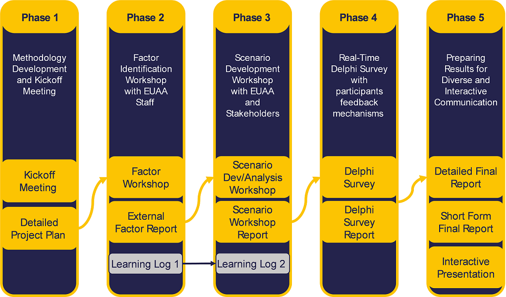

# About

The content presented on this website was developed in the project “The Future of International Protection in the EU+ in the Next 10 Years”, commissioned by the European Union Agency for Asylum (EUAA).

Through this project’s multiple phases (see the Figure below) teams consisting of experts from the EUAA, asylum authorities of several EU+ countries (Belgium, Finland, France, Germany, Italy, Malta, the Netherlands, Norway and Slovenia), the European Commission (DG HOME, Joint Research Centre), Frontex, Europol, UNHCR, ICMPD and Fraunhofer ISI created a set of coherent future scenarios – narratives that enable policy and decision makers to better perceive and respond to the complexity and uncertainty of possible futures.

To develop alternative future scenarios, it is first necessary to gather, organise, and assess information about [key factors](/factors/hub) that are influencing the development of international protection and asylum-related migration. Such factors were initially identified through a literature review and expert interviews with EUAA staff and were further elaborated in a dedicated workshop (Phase 2). 

These fundamental factors then became the foundation for scenario writing and analysis activities (Phase 3). The participatory scenario process was designed to accommodate the diversity of the workshop attendees and help them articulate pre-existing ideas they associated with the future developments and impacts of each factor. This enabled participants to robustly define the boundaries of each factor’s option space for development in the future and simultaneously encouraged participants to identify taboo topics and other types of cognitive bias that were at play when discussing the futures of international protection. The process yielded four unique and viable [future scenario narratives](/scenarios/hub) with corresponding personas that support immersion into each scenario world and results of the in-depth analysis.

The developed scenarios were further analysed to identify [key challenges and opportunities](/challenges/hub) and highlight areas for strategic and operational development thus enabling organisations to better anticipate future challenges and needs. The analysis was carried out through another interactive workshop (Phase 3) and expert-based Delphi survey (Phase 4) to identify critical challenges. The Delphi survey helped gather quantitative and qualitative expert feedback into the likelihood and anticipated time-horizon for critical aspects of each scenario. The identified challenges focused on scenario-specific implications for international protection actors and on modes of building institutional resilience by addressing challenges common across multiple scenarios.

{: .align-center }
